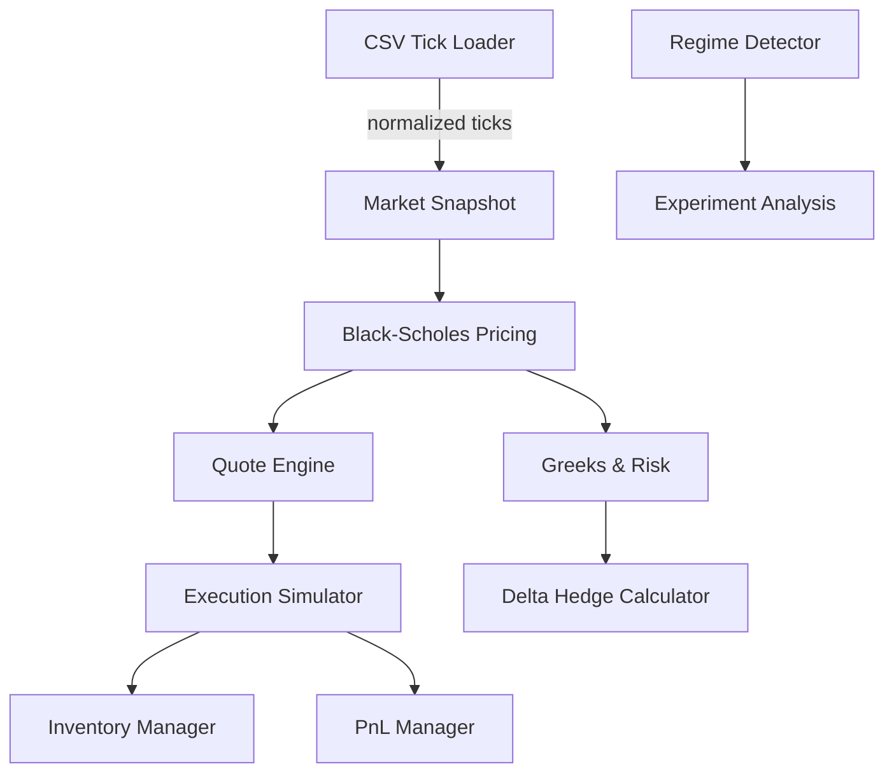

# Architecture

## System Overview

The `Options Market-Making Simulator` is built as a modular Python package with clearly separated responsibilities:

- `data.loader` handles CSV tick ingestion and feature engineering.
- `pricing.black_scholes` computes option prices and Greeks using the Black-Scholes model.
- `market.quote_engine` turns theoretical prices into bid/ask quotes.
- `execution.execution` models order execution for market and limit orders.
- `risk.inventory` tracks positions and enforces inventory limits.
- `metrics.pnl` computes realized and mark-to-market profit and loss.
- `hedge.delta` provides delta aggregation and hedge sizing.
- `experiments.regime` supports volatility-regime detection experiments.

## Component Diagram

## Data Flow

1. `load_option_ticks_csv()` imports tick-level option data and computes the mid price and time-to-expiry.
2. Pricing functions compute theoretical call/put prices and Greeks from underlying state.
3. Quotes are derived from theoretical mid values plus configurable half-spreads.
4. The execution model simulates fills and updates position state.
5. Inventory and PnL managers keep track of the portfolio footprint and profit.

## Design Goals

- Minimal, testable primitives
- Modular components suitable for academic or research prototyping
- Clear separation between pricing, quoting, execution, and risk management
